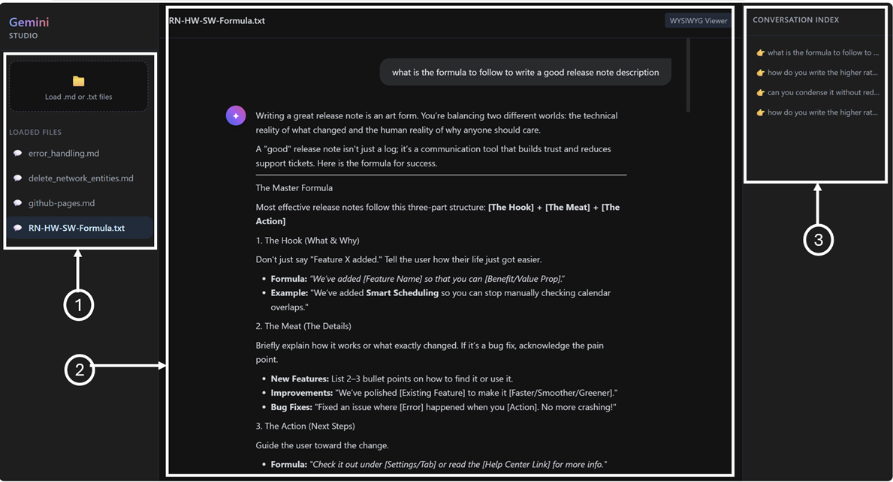

# Offline Gemini-style Markdown Previewer

Markdown supports WYSIWYG. There are many free WYSIWYG editors available online to preview the markdown output. But, you need to have an internet connection to use those online WYSIWYG previewers. The good and free WYSIWYG previewers that I worked were web-based previewers. To circumvent the internet prequisite, I built an offline markdown previewer.

I used Google Gemini to create an offline WYSIWYG previewer. This offline previewer displays content in a three-column layout.



|Callout| Column | Functionality |
|-------|--------| --------------|
|1 | Left | :file_folder: icon to add the markdown files from your system. ` LOADED FILES ` section to list all the files added to the previewer.|
|2 | Middle | Markdown output in Gemini-style conversational UI|
|3 | Right | List of H1 titles|

!!! note

You can add up to five markdown files and preview them in a Gemini-style UI and switch between the files without the fear of losing them.

!!! note

Memory is not static for this previewer. Everytime you close the window, added files are removed.

1. Copy the HTML code and save it in your local system.
2. Open the saved HTML file.
3. In the left panel, click the 📁 icon and add your markdown files.
   !!! Success

   The markdown output appears in a Gemini-style UI.
   
```html
<!DOCTYPE html>
<html lang="en">
<head>
    <meta charset="UTF-8">
    <meta name="viewport" content="width=device-width, initial-scale=1.0">
    <title>Gemini-Style 3-Column Markdown Studio</title>
    <script src="https://cdn.tailwindcss.com"></script>
    <script src="https://cdn.jsdelivr.net/npm/marked/marked.min.js"></script>
    <style>
        body {
            font-family: 'Segoe UI', Roboto, Helvetica, Arial, sans-serif;
            background-color: #131314;
            color: #e3e3e3;
        }
        .prose pre {
            background-color: #1e1e1f;
            padding: 1rem;
            border-radius: 0.5rem;
            overflow-x: auto;
            margin: 0.5rem 0;
        }
        .prose code {
            font-family: monospace;
            background-color: #282a2c;
            padding: 0.2rem 0.4rem;
            border-radius: 0.25rem;
        }
        .prose ul { list-style-type: disc; margin-left: 1.5rem; }
        .prose ol { list-style-type: decimal; margin-left: 1.5rem; }
        html { scroll-behavior: smooth; }
        ::-webkit-scrollbar { width: 6px; }
        ::-webkit-scrollbar-track { background: transparent; }
        ::-webkit-scrollbar-thumb { background: #2a2a2a; border-radius: 4px; }
    </style>
</head>
<body class="flex h-screen overflow-hidden text-sm">

    <aside class="w-64 bg-[#1e1e1f] border-r border-gray-800 flex flex-col h-full flex-shrink-0">
        <div class="p-4 border-b border-gray-800">
            <span class="text-xl font-semibold text-transparent bg-clip-text bg-gradient-to-r from-blue-400 via-purple-400 to-red-400">Gemini</span>
            <span class="text-gray-400 text-xs font-medium uppercase tracking-wider block">Studio</span>
        </div>

        <div class="p-4">
            <label class="w-full flex flex-col items-center justify-center bg-[#131314] hover:bg-[#282a2c] border border-dashed border-gray-700 hover:border-blue-500 rounded-xl p-4 cursor-pointer text-center transition group">
                <span class="text-blue-400 group-hover:scale-110 transition text-lg">📁</span>
                <span class="text-xs text-gray-400 mt-1">Load .md or .txt files</span>
                <input type="file" id="file-selector" multiple accept=".md,.txt" class="hidden">
            </label>
        </div>

        <div class="px-4 py-2 text-xs font-semibold text-gray-500 uppercase tracking-wider">Loaded Files</div>
        <nav id="file-list" class="flex-1 overflow-y-auto px-2 pb-4 space-y-1">
            <div class="text-gray-600 px-4 py-2 text-xs italic">No files loaded yet. Drag some in!</div>
        </nav>
    </aside>

    <div class="flex-1 flex flex-col h-full bg-[#131314] border-r border-gray-800 overflow-hidden">
        <header class="p-4 border-b border-gray-800 bg-[#131314]/80 backdrop-blur-md sticky top-0 flex justify-between items-center">
            <span id="active-chat-title" class="font-medium text-gray-300">Workspace Empty</span>
            <span class="text-xs bg-gray-800 px-2 py-1 rounded text-gray-400">WYSIWYG Viewer</span>
        </header>

        <main id="chat-container" class="flex-1 px-6 py-8 space-y-12 overflow-y-auto max-w-3xl w-full mx-auto">
            <div class="text-center py-20 text-gray-500 space-y-2">
                <p class="text-lg">✨ Welcome to your Gemini Webviewer</p>
                <p class="text-xs max-w-xs mx-auto">Upload any markdown files using the left panel. The conversation will cleanly parse here.</p>
            </div>
        </main>
    </div>

    <aside class="w-60 bg-[#1e1e1f] flex flex-col h-full flex-shrink-0 overflow-hidden">
        <div class="p-4 border-b border-gray-800">
            <span class="text-xs font-semibold text-gray-400 uppercase tracking-wider">Conversation Index</span>
        </div>
        <nav id="toc-list" class="flex-1 overflow-y-auto p-3 space-y-1">
            <div class="text-gray-600 px-2 py-1 text-xs italic">Select a file to populate links.</div>
        </nav>
    </aside>

    <script>
        // Track uploaded files in application memory
        let loadedFiles = [];
        let activeFileIndex = null;

        // Dom Elements
        const fileSelector = document.getElementById('file-selector');
        const fileListContainer = document.getElementById('file-list');
        const tocContainer = document.getElementById('toc-list');
        const chatContainer = document.getElementById('chat-container');
        const activeTitle = document.getElementById('active-chat-title');

        // Handle file loading via FileReader API (Bypasses local server issues completely!)
        fileSelector.addEventListener('change', (e) => {
            const files = Array.from(e.target.files);
            
            files.forEach(file => {
                const reader = new FileReader();
                reader.onload = (event) => {
                    loadedFiles.push({
                        name: file.name,
                        content: event.target.result
                    });
                    renderFileList();
                    if (activeFileIndex === null) switchToFile(loadedFiles.length - 1);
                };
                reader.readAsText(file);
            });
        });

        // Render Left Column List
        function renderFileList() {
            fileListContainer.innerHTML = '';
            loadedFiles.forEach((file, index) => {
                const btn = document.createElement('button');
                const isActive = index === activeFileIndex;
                btn.className = `w-full text-left px-3 py-2 rounded-xl truncate flex items-center gap-2 transition ${
                    isActive ? 'bg-[#004a77]/30 text-[#c2e7ff] font-medium' : 'text-gray-400 hover:bg-[#282a2c]'
                }`;
                btn.innerHTML = `<span>💬</span> <span class="truncate">${file.name}</span>`;
                btn.onclick = () => switchToFile(index);
                fileListContainer.appendChild(btn);
            });
        }

        // Switch conversations seamlessly
        function switchToFile(index) {
            activeFileIndex = index;
            renderFileList();
            const file = loadedFiles[index];
            activeTitle.innerText = file.name;
            parseAndRenderChat(file.content);
        }

        // Parse Middle Column and Map Right Column H1 list
        function parseAndRenderChat(markdownText) {
            chatContainer.innerHTML = '';
            tocContainer.innerHTML = '';

            const segments = markdownText.split(/(?=^#\s.+)/m);
            let tocItemsHtml = '';

            segments.forEach((segment, idx) => {
                const trimmed = segment.trim();
                if (!trimmed) return;

                const lines = trimmed.split('\n');
                const rawUserTitle = lines[0];
                const rawGeminiResponse = lines.slice(1).join('\n');

                const userContent = rawUserTitle.replace(/^#\s+/, '');
                const userHtml = marked.parse(userContent);
                const geminiHtml = marked.parse(rawGeminiResponse);

                // Create unique ID anchor for navigating
                const blockId = `chat-block-${idx}`;

                // Append right sidebar (H1 Index) link
                if (userContent.trim()) {
                    const tocBtn = document.createElement('button');
                    tocBtn.className = "w-full text-left text-xs text-gray-400 hover:text-blue-400 py-1.5 px-2 rounded hover:bg-[#282a2c] truncate block transition";
                    tocBtn.innerText = `👉 ${userContent}`;
                    tocBtn.onclick = () => {
                        document.getElementById(blockId)?.scrollIntoView({ behavior: 'smooth' });
                    };
                    tocContainer.appendChild(tocBtn);
                }

                // Create a container row matching both elements grouped under this anchor
                const anchorWrapper = document.createElement('div');
                anchorWrapper.id = blockId;
                anchorWrapper.className = "space-y-8 scroll-mt-20";

                // Middle Column: Render User Bubble
                if (userContent.trim()) {
                    const userRow = document.createElement('div');
                    userRow.className = 'flex gap-4 justify-end';
                    userRow.innerHTML = `
                        <div class="max-w-[85%] bg-[#282a2c] text-gray-200 px-5 py-3 rounded-2xl rounded-tr-sm shadow-md prose prose-invert text-sm">
                            ${userHtml}
                        </div>
                    `;
                    anchorWrapper.appendChild(userRow);
                }

                // Middle Column: Render Gemini Bubble
                if (rawGeminiResponse.trim()) {
                    const geminiRow = document.createElement('div');
                    geminiRow.className = 'flex gap-4 justify-start';
                    geminiRow.innerHTML = `
                        <div class="flex gap-4 max-w-[90%] w-full">
                            <div class="w-8 h-8 rounded-full bg-gradient-to-tr from-blue-600 via-purple-500 to-pink-500 flex items-center justify-center flex-shrink-0 shadow-lg">
                                <span class="text-white text-xs font-bold">✦</span>
                            </div>
                            <div class="prose prose-invert text-gray-300 space-y-2 text-sm leading-relaxed pt-1 w-full">
                                ${geminiHtml}
                            </div>
                        </div>
                    `;
                    anchorWrapper.appendChild(geminiRow);
                }

                chatContainer.appendChild(anchorWrapper);
            });

            if (loadedFiles[activeFileIndex] && tocContainer.children.length === 0) {
                tocContainer.innerHTML = '<div class="text-gray-600 px-2 py-1 text-xs italic">No H1 headers found.</div>';
            }
        }
    </script>
</body>
</html>
```

<!-- Google gemini is a great AI chatbot tool. I interact with the chatbot whenever I have some queries.
I had a issue with the chatbot responses. It was that I had to use the scroller everytime, I wanted to check the previous query in the chat.
To reduce frequent scrolling, I decided to have an offline chat window. I asked gemini to build me one. And I got this one. -->

<!-- I tried a python based markdown previewer

## Pre-requisites

- **Python 3**: `python -m http.server 8000`
- **Python 2**: `python -m SimpleHTTPServer 8000`

Then open your browser and go to `http://localhost:8000`.

## Troubleshooting

### 1. Check Python's Terminal Output (The Clue)

Look at the terminal window where you ran `python -m http.server 8000`. Every time you refresh your browser, Python logs the requests.

Refresh your page and look at the last few lines in that terminal:

* **If you see `GET /chat.md HTTP/1.1" 404 -`:** This means Python is working perfectly, but it **cannot find** a file named `chat.md` in the folder it is currently serving.
* **If you see `GET /chat.md HTTP/1.1" 200 -`:** This means Python *successfully* sent the file to your browser, meaning the issue is inside your JavaScript code or browser cache.

### 2. Verify Your "Terminal Path"

Python only serves the folder your terminal was pointing to *at the exact moment* you ran the command.

If you opened your terminal, and immediately typed `python -m http.server 8000` without navigating to your project folder first, Python is likely serving your computer's user profile folder instead of your project folder.

**The Fix:**

1. Stop the server in your terminal by pressing `Ctrl + C`.
2. Navigate to your project folder. For example:
```bash
cd path/to/your/project-folder

```
3. Restart the server:
```bash
python -m http.server 8000

```

### 3. The Hidden `.txt` Extension (Most Common)

If Python is giving you a `404` error and you are positive you are in the right folder, your operating system has likely hidden the true extension of your file.

If you created `chat.md` using Notepad (Windows) or TextEdit (Mac), the file is likely actually named **`chat.md.txt`**, but the system is hiding the `.txt` from your eyes. Because your code looks for `./chat.md`, it fails.

**The Fix:**

* **Windows:** In File Explorer, click the **View** tab at the top and check **File name extensions**. If it says `chat.md.txt`, rename it to delete the `.txt`.
* **Mac:** Right-click the file, select **Get Info**, and look under **Name & Extension**. Remove `.txt` if it's there.

---

### How to see the exact error code

To know for sure what's failing, right-click your blank webpage, click **Inspect**, and open the **Console** tab.

* Do you see a red error message there?
* If you click the **Network** tab in that inspector and refresh, does `chat.md` show up in red with a `404` status?

Let me know what your browser console or your Python terminal says, and we'll pinpoint it!

# yes, it showing it as error, but the chat.md file is being downloaded everytime

Ah, that is a massive clue! If the `chat.md` file is actively **downloading** to your computer every time the page loads instead of displaying on the screen, your local server setup is working perfectly.

The issue is how the Python server is telling your browser to handle the file.

By default, some versions of Python's `http.server` send `.md` files with a header that tells the browser: *"Hey, this is a random binary file, don't read it, just download it!"* Because the browser forces a download, JavaScript's `fetch()` function gets blocked or receives empty data, throwing that console error.

Here are the two easiest ways to fix this immediately:

---

### Fix 1: Change the File Extension to `.txt` (Easiest)

Browsers and Python *always* know how to handle `.txt` files properly without forcing a download.

1. Rename your markdown file from `chat.md` to **`chat.txt`**. (Keep all the markdown content inside it exactly the same!)
2. In your `index.html` file, update the file path line at the top of your script to look for the text file:
```javascript
const filePath = './chat.txt'; 

```


3. Save the HTML file and refresh your browser. It will stop downloading and display perfectly.

---

### Fix 2: Tell Python to Map `.md` Files Correctly

If you strictly want to keep the `.md` extension, you can tell Python to serve `.md` files as plain text instead of downloadable attachments.

Instead of running the standard command, create a tiny script to launch your server.

1. Create a file named `server.py` in your project folder.
2. Paste this code into it:
```python
import http.server
import socketserver

# Tell the server to treat .md files as plain text
handler = http.server.SimpleHTTPRequestHandler
handler.extensions_map.update({
    '.md': 'text/plain',
})

PORT = 8000
with socketserver.TCPServer(("", PORT), handler) as httpd:
    print(file=f"Server started at http://localhost:{PORT}")
    httpd.serve_forever()

```


3. Run this file in your terminal instead:
```bash
python server.py

```


Go with **Fix 1** if you want a 5-second fix, or **Fix 2** if keeping the `.md` extension is important for your workflow. Which route do you prefer?
-->
